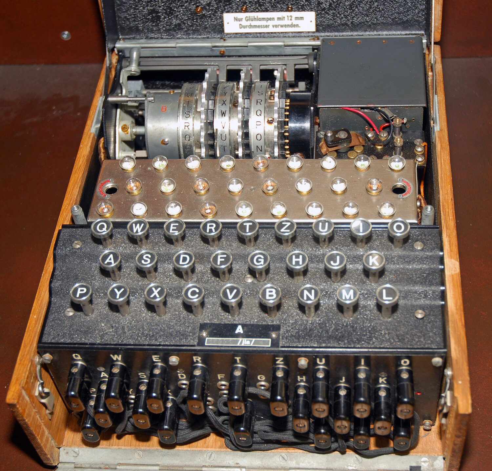
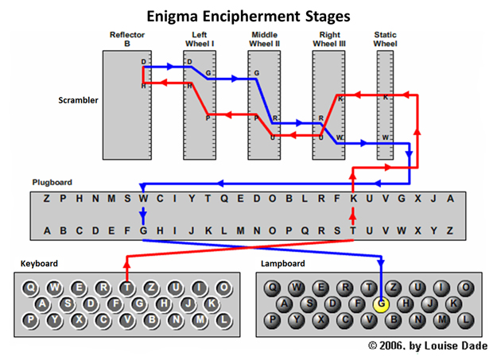
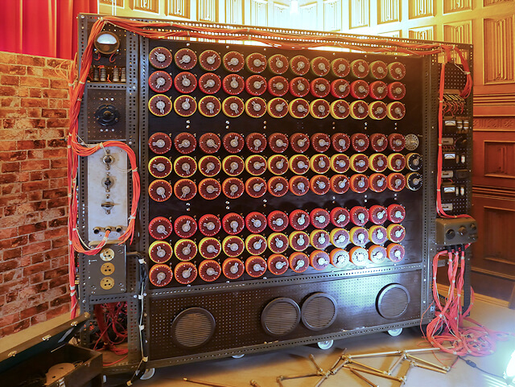
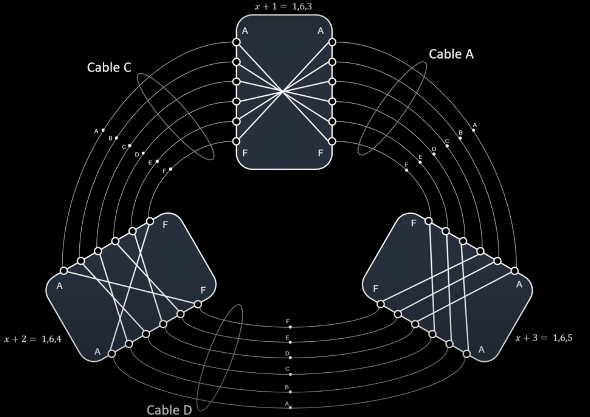

    This project aims to emulate the Enigma and Bombe machines, used during the second world war to respectively encode messages and decode them.

    # The Enigma Machine

    The Enigma was a machine used by the germans to encode messages and send them safely.

    It was made up of different parts:

    ### Keyboard

    This part simply allowed the user to input a letter (out of the 26 letter alphabet).

    ### Plugboard

    The plugboard contained two series of contacts. In different versions there could be a different number of cables that connected one letter to another one, for example A-B C-D E-F. Each letter could only be connected once, and a letter that was not connected by a cable was by default connected to itself. The cables were connected differently each day.

    In this project I have considered 3 cables.

    ### Rotors

    The rotors, a different number depending on the machine but generally three, were disks containing 26 contacts and a number of notches. Every time a letter was encrypted, the first rotor rotated by one. When a rotor met one of its notches, it cause the next rotor to rotate too.

    There would be a number of rotors to choose from every day, to switch in and out of the Enigma.

    In this project I have considered 3 rotors.

    ### Reflector

    This element was similar to a plugboard but with exactly 13 cables, so each letter was encoded to a different one. Similarly to rotors, a reflector could be chosen out of a set of previously built ones. It allowed to "reflect" the signal back to the rotors, making its way through backwards.

    ### Light-up board

    The encoded letter would light up on a board of bulbs, showing the result of the process.

    ## Setup

    These elements would all be connected in the order used above, inside a machine. Here are a few pictures to show the mechanics and how the machine looked:

    

    

    

    

    Every day the germans would know the daily settings and setup the enigmas for that day's encoding. These settings included the initial position of the three rotors, which rotors and reflector to select, and the plugboard settings. This worked because a message could be decoded by just setting an enigma to the same settings the original message had been decoded from. This was feasible because a letter, encoded twice on the same settings, would go back to itself. This seems like a positive point, but as we will see it was also one of its weaknesses.

    

    # The Bombe Machine

    Messages that were intercepted and successfully decoded could allow a significant military advantage. For this reason many mathematicians tried to solve this problem. The breakthrough was made by Alan Turing and other scientists at Bletchley park, in Great Britain, building the Bombe. But how did the decoding work?

    ### Finding a key to look for: the crib

    We would need to look for a key that was most likely present in the messages: in the war, they would look for "Heil Hitler" as they noticed it was present in the end of most german messages. A weakness of Enigma was that a letter could never be encoded to itself, so we had to look in the message for a "crib": a sequence as long as the key that had no letter corresponding in both sequences.

    

    ### Finding a loop and exploiting the mechanics

    After that, they would look for a loop of letters (in my project, three) in the pairings. For example, A encodes to B, B encodes to C, C encodes to A. They would save the positions of these pairings in the crib.

    Then they would set three enigmas with empty plugboards settings and connect them together with cables for every plugboard position. We would know it's a possible rotor setting when only one path "lights up", meaning that those are the plugboard settings.

    The Bombe would iterate through different positions and stop when one position had a possible setting. Then it would be checked if it was an adequate solution for that day's setting.

    Here are some pictures of how the Bombe looked and how the solving algorithm worked:

    

    

    # In this project

    In this project there are tools to construct working enigmas (coded with the help of some projects found online, readapted to fit my project) with classes to build the different mechanical parts and an overall "enigma" class.

    ## run_bombe 
    Via the makefile you can run the bombe (make run_bombe) and it will print in the output file the possible positions it would have stopped at. It is important to note that even then not every day was a good day to find rotor positions, since many loops and cribs had to be tried and not always they were useful. So this is not guaranteed to give a solution, it is implemented more from an historical interest.

    ## run_bruteforce
    Via the makefile you can also run the brute-force version (make run_bruteforce), that uses parallel methods to try all the settings and find a key in one of them. This shows how modern technology would have "killed" the enigma instantly, or at least in a matter of seconds.*

    *for this version, I generated a printed list of all the possible plugboard settings for three plugs, as to not have to calculate the combinations every time. This is done in makepluglist.cpp